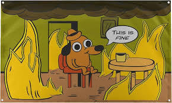

# 📄 README - PROJETO DE SIMLUAÇÃO DE PROPAGAÇÃO DE INCÊNCIOS

<div align="center">
    
</div>

<div align="center">

##  Simulação de Propagação de Incêndios

</div>

## ☕ Introdução
O projeto "Simulação de Propagação de Incêndios" foi proposto como o trabalho de aquecimento da disciplina de Algoritmo e Estrutura de Dados (AEDS) pelo Prof. Mestre Michel Pires Da Silva. Tal atividade propôs a criação de um código (em C ou C++) que pudesse implementar tal simulação e também exigiu uma documentação detalhada sobre o algoritmo. Ademais, o código consiste em um simulador que propaga um incêndio em uma floresta (representada por uma matriz), na qual há um animal que deve se mover por ela. Além disso, cada célula da matriz tem sua devida representação, sendo 0: Área vazia, 1: Árvore saudável, 2: Árvore em chamas, 3: Árvore queimada e 4: Água.

## 🎯 Objetivos
O objetivo principal consiste em modelar a propagação do fogo em uma matriz, o qual pode evoluir ao longo da execução, conforme as interações de propagação de incêndio. A implementação deverá permitir a utilização de diferentes estratégias computacionais para a propagação do fogo, proporcionando uma análise comparativa do desempenho e da eficiência do código.


## 🖥️ Ambiente de Criação
- 
- 
- -E95420?logo=ubuntu&logoColor=white)

O trabalho inteiro foi feito em C++. Além do mais, a IDE utilizada foi o Visual Studio Code (VS Code), no qual foi utilizado o ambiente de desenvolvimento WSL Ubuntu. No entanto, o sistema operacional principal utilizado foi o Windows.

## 📂 Organização dos Arquivos
Os arquivos de entrada e saída (input.dat e output.dat, respectivamente) estão na pasta "AEDS", juntamente com o Makefile, já os arquivos cpp e hpp estão em uma subpasta chamada "src" dentro da pasta "AEDS".
```
AEDS/
├── .vscode/
├── build/
├── src/
│   ├── Animal.cpp
│   ├── Animal.hpp
│   ├── Arquivo.cpp
│   ├── Arquivo.hpp
│   ├── Config.cpp
│   ├── Config.hpp
│   ├── Incendio.cpp
│   ├── Incendio.hpp
│   ├── Main.cpp
│   ├── Matriz.cpp
│   ├── Matriz.hpp
│   ├── Modulo.cpp
│   ├── Modulo.hpp
│   ├── ModuloAgua.cpp
│   ├── ModuloAgua.hpp
│   ├── ModuloAreaVazia.cpp
│   ├── ModuloAreaVazia.hpp
│   ├── ModuloArvoreFogo.cpp
│   ├── ModuloArvoreFogo.hpp
│   ├── ModuloArvoreQueimada.cpp
│   ├── ModuloArvoreQueimada.hpp
│   ├── ModuloArvoreSaudavel.cpp
│   ├── ModuloArvoreSaudavel.hpp
├── input.dat
├── output.dat
├── Makefile
├── Makefile :Zone.Identifier
```

## 💡 Implementação
### Funções
- `lerArq (Tipo: void, Parâmetro: Arquivo arquivo)`  
    Essa função tem como objetivo ler o arquivo de entrada em prol da construção da matriz.
    ```cpp
    void Arquivo::lerArq(Arquivo arq){
        int numLinha, numColuna, colunaIncendio, linhaIncendio, linha = 0, coluna = 0, fogo = 0, linhasLidas = 0, spaceBar = 0, lugarSeguro = 0, colunaAnimal = 0, linhaAnimal = 0;
        std::string linhaLeitura, nomeArquivo = arq.getNome(), nomeArquivoSaida = "output.dat";
        std::ifstream entrada(nomeArquivo);
        std::ofstream saida(nomeArquivoSaida, std::ios::app);
        
        
        if(!entrada){
            std::cerr << "Erro: falha ao abrir o arquivo de entrada: '" << nomeArquivo << "'. Encerrando o programa.";
            saida.flush();
            saida.close();
            exit(0);
        }
        
        if(config.getDirecaoVentoTodos() && (config.getDirecaoVentoNorte() || config.getDirecaoVentoLeste() || config.getDirecaoVentoSul() || config.getDirecaoVentoOeste())){
            saida << "Erro: vento para todas as direções não pode ser ativado simultaneamente com os outros tipos de direção. Encerrando o programa.";
            saida.flush();
            saida.close();
            exit(0);    
        }

        entrada >> numLinha >> numColuna >> colunaIncendio >> linhaIncendio;
        Matriz matriz(numLinha, numColuna, config);
        
        std::getline(entrada, linhaLeitura);
        
        while(std::getline(entrada, linhaLeitura)){
            if(linhasLidas >= numLinha){
                saida << "Erro: mais linhas encontradas do que o especificado em " << nomeArquivo << ". Encerrando o programa.";
                return;
            }
            for(char ch : linhaLeitura){
                if(ch == ' '){
                    spaceBar++;
                }
            }
            if((int)linhaLeitura.length() - spaceBar != numColuna){
                saida << "Erro: número de colunas incorreto na linha " << linhasLidas + 2 << " do arquivo " << nomeArquivo << ". Encerrando o programa.";
                return;
            }
            spaceBar = 0;
            for(char ch : linhaLeitura){
                if(ch == '\n' || ch == ' '){
                    continue;
                }
                else if(ch == '2'){
                    fogo++;
                    if(fogo > 1){
                        saida << "Erro: mais de um ponto de incêndio registrado na matriz. Encerrando o programa.";
                        return;
                    }
                    if(linha != colunaIncendio || coluna != linhaIncendio){
                        saida << "Erro: ponto de incêndio registrado em (" << linhasLidas << ", " << coluna << ") não condiz com a posição previamente cadastrada. Encerrando o programa.";
                        return;
                    }
                }
                else if(ch == '0'){
                    lugarSeguro++;
                    if(lugarSeguro == 1){
                        linhaAnimal = linhasLidas;
                        colunaAnimal = coluna;
                    }
                }
                else if(ch != '0' && ch != '1' && ch != '2' && ch != '3' && ch != '4'){
                    saida << "Erro: caractere inválido em (" << linhasLidas << ", " << coluna << ") do arquivo " << nomeArquivo << ". Encerrando o programa.";
                    return;
                }
                matriz.addModulo(linha, coluna, ch);
                coluna++;
                if(coluna == numColuna){
                    coluna = 0;
                    linha++;
                }
            }
            linhasLidas++;
        }
        if(linhasLidas != numLinha){
            saida << "Erro: número de linhas lido diferente do especificado no arquivo " << nomeArquivo << ". Encerrando o programa.";
            return;
        }
        if(fogo == 0){
            saida << "Erro: nenhum ponto de incêndio foi registrado na matriz. Encerrando o programa.";
            return;
        }
        if(lugarSeguro == 0){
            saida << "Erro: nenhum lugar seguro foi registrado na matriz. Encerrando o programa.";
            return;
        }
        Animal animal(linhaAnimal, colunaAnimal, matriz, config);
        Incendio incendio(colunaIncendio, linhaIncendio, matriz, animal);
        incendio.espalharFogo(config);
        
        entrada.close();
        saida.flush();
        saida.close();
        
        return;
    }
    ```
    - `imprimirMatriz (Tipo: void)`  
    Essa função tem como objetivo imprimir a matriz a cada iteração.

    ```cpp
    void Matriz::imprimirMatriz(){
        std::string nomeArquivoSaida = "output.dat";
        std::ofstream saida(nomeArquivoSaida, std::ios::app);

        if(!saida){
            std::cerr << "Erro: falha ao abrir o arquivo de saída: '" << nomeArquivoSaida << "'. Encerrando o programa." << std::endl;
            saida.flush();
            saida.close();
            return;
        }
        saida << "iteração " << config.getVezesRodadas() << ":\n";
        for(int i = 0; i < linhas; i++){
            for(int j = 0; j < colunas; j++){
                if(i == linhaAnimal && j == colunaAnimal){
                    saida << "A ";
                }
                else{
                    saida << matriz[i][j]->getTipo() << " ";
                }
            }
            saida << "\n";
        }
        saida << "\n";
        config.addVezesRodadas();

        saida.flush();
        saida.close();
    }
    ```
     - `verificaParadaFloresta (Tipo: bool)`  
    Essa função tem como objetivo verificar se ainda há árvores a serem queimadas.

    ```cpp
    bool Matriz::verificaParadaFloresta(){
        auto mapa = getMatriz();
        int qntLinhas = getLinhas();
        int qntColunas = getColunas();
        bool todos = config.getDirecaoVentoTodos();
        bool norte = config.getDirecaoVentoNorte();
        bool leste = config.getDirecaoVentoLeste();
        bool sul = config.getDirecaoVentoSul();
        bool oeste = config.getDirecaoVentoOeste();
        std::string nomeArquivoSaida = "output.dat";
        std::ofstream saida(nomeArquivoSaida, std::ios::app);

        if(!saida){
            std::cerr << "Erro: falha ao abrir o arquivo de saída: '" << nomeArquivoSaida << "'. Encerrando o programa." << std::endl;
            saida.flush();
            saida.close();
            exit(0);
        }

        for(int i = 0; i < linhas; i++){
            for(int j = 0; j < colunas; j++){
                if(mapa[i][j]->getTipo() == '1' || (i == linhaAnimal && j == colunaAnimal)){
                    if(i - 1 >= 0 && mapa[i - 1][j]->getTipo() == '2' && (norte || todos)){
                        return false;
                    }
                    if(j + 1 < qntColunas && mapa[i][j + 1]->getTipo() == '2' && (leste || todos)){
                        return false;
                    }
                    if(i + 1 < qntLinhas && mapa[i + 1][j]->getTipo() == '2' && (sul || todos)){
                        return false;
                    }
                    if(j - 1 >= 0 && mapa[i][j - 1]->getTipo() == '2' && (oeste || todos)){
                        return false;
                    }
                }
            }
        }
        return true;
    }
    ```

     - `verificaParadaIteracao (Tipo: bool)`  
    Essa função tem como objetivo verificar se o número de iterações máximo foi atingido.

    ```cpp
    bool Matriz::verificaParadaIteracao(){
        std::string nomeArquivoSaida = "output.dat";
        std::ofstream saida(nomeArquivoSaida, std::ios::app);

        if(!saida){
            std::cerr << "Erro: falha ao abrir o arquivo de saída: '" << nomeArquivoSaida << "'. Encerrando o programa." << std::endl;
            saida.flush();
            saida.close();
            exit(0);
        }
        if(config.getVezesRodadas() == config.getQntIteracoes() + 1){
            return true;
        }
        return false;
    }
    ```

    - `registraResumo (Tipo: void)`  
    Essa função tem como objetivo registrar o resumo final da simulação.

    ```cpp
    void Matriz::registraResumo(){
        std::string nomeArquivoSaida = "output.dat";
        std::ofstream saida(nomeArquivoSaida, std::ios::app);
        bool estaMorto = false;

        if(!saida){
            std::cerr << "Erro: falha ao abrir o arquivo de saída: '" << nomeArquivoSaida << "'. Encerrando o programa." << std::endl;
            saida.flush();
            saida.close();
            exit(0);
        }
        
        if(verificaParadaFloresta()){
            saida << "Não há mais árvores a serem queimadas. Fim do jogo.\n\n";
            saida.flush();
        }
        else if(verificaParadaIteracao()){
            saida << "Quantidade máxima de interações atingida. Fim do jogo.\n\n";
            saida.flush();
        }
        else{
            saida << "Animal pegou fogo. Fim do jogo.\n\n";
            estaMorto = true;
            saida.flush();
        }
        saida << "- - - - - Resumo geral: - - - - -\n\n";
        saida.flush();
        saida << "- Pontos de água encontrados: " << aguasEncontradas << ".\n";
        saida.flush();
        saida << "- Passos dados: " << passos << ".\n";
        saida.flush();
        if(config.getVezesRodadas() - 1 == 1 && estaMorto){
            saida << "- Animal pegou fogo na " << config.getVezesRodadas() - 1 << "ª iteração.\n";
            saida.flush();
            saida << "- Status do animal: morto.";
            saida.flush();
        }
        else if(config.getVezesRodadas() - 1 == 1 && !estaMorto){
            saida << "- Status do animal: vivo.";
            saida.flush();
        }
        else{
            int cont = 1;

            for(int i = 0; i < config.getVezesRodadas() - 1; i++){
                bool naoSeMoveu = false;

                saida << "- Caminho feito na " << i + 1 << "ª iteração: ";
                for(int iteracao : naoMoveu){
                    if(i + 1 == iteracao){
                        saida << "Animal não se moveu na " << i + 1 << "ª iteração.\n";
                        saida.flush();
                        naoSeMoveu = true;
                        break;
                    }
                }
                if(naoSeMoveu){
                    continue;
                }
                if(cont != 0){
                    saida << "(" << caminho[cont - 1].first << ", " << caminho[cont - 1].second << ") -> ";
                    saida.flush();
                }
                while(cont + 1 < (int)caminho.size() && (caminho[cont - 1].first != caminho[cont].first || caminho[cont - 1].second != caminho[cont].second)){
                    saida << "(" << caminho[cont].first << ", " << caminho[cont].second << ") -> ";
                    saida.flush();
                    cont++;
                }
                if((i + 2 == naoMoveu[naoMoveu.size() - 1] && naoMoveu[naoMoveu.size() - 1] == config.getVezesRodadas() - 1) || (i + 3 == naoMoveu[naoMoveu.size() - 1] && naoMoveu[naoMoveu.size() - 1] == config.getVezesRodadas() - 1)){
                    saida << "(" << linhaAnimal << ", " << colunaAnimal << ") -> ";
                    saida.flush();
                }
                if(i + 1 == config.getVezesRodadas() - 1){
                    saida << "(" << linhaAnimal << ", " << colunaAnimal << ") -> ";
                    saida.flush();
                }
                saida << "Fim da iteração " << i + 1 << "\n";
                saida.flush();
                cont++;
            }
            if(estaMorto){
                saida << "- Animal pegou fogo na " << config.getVezesRodadas() - 1 << "ª iteração.\n";
                saida.flush();
                saida << "- Status do animal: morto.\n";
                saida.flush();
            }
            else{
                saida << "- Status do animal: vivo.\n";
                saida.flush();
            }
            saida << "(Coordenadas em formato de '(linha, coluna)')\n";
        }
        saida.flush();
        saida.close();
        naoMoveu.clear();
        exit(0);
    }
    ```

    - `podeIr (Tipo: bool, Parâmetros: int linha, int coluna, bool todos, bool norte, bool leste, bool sul, bool oeste)`  
    Essa função tem como objetivo verificar se o animal pode ir para alguma célula específica.

    ```cpp
    bool Matriz::podeIr(int linha, int coluna, bool todos, bool norte, bool leste, bool sul, bool oeste){
        auto mapa = getMatriz();
        int qntLinhas = getLinhas();
        int qntColunas = getColunas();

        if(linha - 1 >= 0 && mapa[linha - 1][coluna]->getTipo() == '1' && (norte || todos)){
            return false;
        }
        if(coluna + 1 < qntColunas && mapa[linha][coluna + 1]->getTipo() == '1' && (leste || todos)){
            return false;
        }
        if(linha + 1 < qntLinhas && mapa[linha + 1][coluna]->getTipo() == '1' && (sul || todos)){
            return false;
        }
        if(coluna - 1 >= 0 && mapa[linha][coluna - 1]->getTipo() == '1' && (oeste || todos)){
            return false;
        }
        return true;
    }
    ```
    
    - `viraFogo (Tipo: void, Parâmetros: std::vector<std::pair<int, int>> arvoresFogo, bool todos, bool norte, bool leste, bool sul, bool oeste)`  
    Essa função tem como objetivo propagar o fogo pela matriz.

    ```cpp
    void Incendio::viraFogo(std::vector<std::pair<int, int>> arvoresFogo, bool todos, bool norte, bool leste, bool sul, bool oeste){
        auto mapa = matriz.getMatriz();
        int qntLinhas = matriz.getLinhas();
        int qntColunas = matriz.getColunas();

        for(std::pair<int, int> arvore : arvoresFogo){
            int linha = arvore.first;
            int coluna = arvore.second;

            if(linha - 1 >= 0 && mapa[linha - 1][coluna]->getTipo() == '1' && (norte || todos)){
                mapa[linha - 1][coluna]->setTipo('2');
            }
            if(coluna + 1 < qntColunas && mapa[linha][coluna + 1]->getTipo() == '1' && (leste || todos)){
                mapa[linha][coluna + 1]->setTipo('2');
            }
            if(linha + 1 < qntLinhas && mapa[linha + 1][coluna]->getTipo() == '1' && (sul || todos)){
                mapa[linha + 1][coluna]->setTipo('2');
            }
            if(coluna - 1 >= 0 && mapa[linha][coluna - 1]->getTipo() == '1' && (oeste || todos)){
                mapa[linha][coluna - 1]->setTipo('2');
            }
        }

        matriz.imprimirMatriz();
    }
    ```

    - `espalharFogo (Tipo: void, Parâmetros: Config config)`  
    Essa função tem como objetivo desenvolver a simulação.

    ```cpp
    void Incendio::espalharFogo(Config config){
        auto mapa = matriz.getMatriz();
        int numLinha = matriz.getLinhas();
        int numColuna = matriz.getColunas();
        std::string nomeArquivoSaida = "output.dat";
        std::ofstream saida(nomeArquivoSaida, std::ios::app);

        if(!saida){
            std::cerr << "Erro: falha ao abrir o arquivo de saída: '" << nomeArquivoSaida << "'. Encerrando o programa." << std::endl;
            saida.flush();
            saida.close();
            exit(0);
        }
        
        while(!matriz.verificaParadaFloresta() && !matriz.verificaParadaIteracao() && !animal.estaPreso(animal.getLinha(), animal.getColuna())){
            for(int i = 0; i < numLinha; i++){
                for(int j = 0; j < numColuna; j++){
                    if(matriz.getMatriz()[i][j]->getTipo() == '2'){
                        addArvoresFogo(std::make_pair(i, j));
                        addArvoresQueimadas(std::make_pair(i, j));
                    }
                }
            }
            animal.iniciarJogo();
            viraFogo(getArvoresFogo(), config.getDirecaoVentoTodos(), config.getDirecaoVentoNorte(), config.getDirecaoVentoLeste(), config.getDirecaoVentoSul(), config.getDirecaoVentoOeste());
            viraQueimada(getArvoresQueimadas());
            getArvoresFogo().clear();
            getArvoresQueimadas().clear();
        }
            
        matriz.registraResumo();
    }
    ```

    - `viraQueimada (Tipo: void, Parâmetros: std::vector<std::pair<int, int>> arvoresQueimadas)`  
    Essa função tem como objetivo transformar as árvores em fogo para árvores queimadas.

    ```cpp
    void Incendio::viraQueimada(std::vector<std::pair<int, int>> arvoresQueimadas){
        auto mapa = matriz.getMatriz();

        for(std::pair<int, int> arvore : arvoresQueimadas){
            int linha = arvore.first;
            int coluna = arvore.second;

            mapa[linha][coluna]->setTipo('3');
        }
    }
    ```

    - `iniciarJogo (Tipo: void)`  
    Essa função tem como objetivo movimentar o animal pela matriz.

    ```cpp
    void Animal::iniciarJogo(){ 
        std::string nomeArquivoSaida = "output.dat";
        std::ofstream saida(nomeArquivoSaida, std::ios::app);

        if(!saida){
            std::cerr << "Erro: falha ao abrir o arquivo de saída: '" << nomeArquivoSaida << "'. Encerrando o programa." << std::endl;
            saida.flush();
            saida.close();
            exit(0);
        }

        
        if(getAnimalNoZero() == 0){
            config.addVezesRodadas();
            if(buscarAgua()){
                return;
            }
            if(buscarVazioArvoreSaudavel()){
                return;
            }
            if(buscarArvoreQueimada()){
                return;
            }
        }
        if(config.getVezesRodadas() != 1){
            addAnimalNoZero();
        }
        if(getAnimalNoZero() == 3){
            this->animalNoZero = 0;
        }
        matriz.setLinhaAnimal(this->linhaAnimal);
        matriz.setColunaAnimal(this->colunaAnimal);
        matriz.addNaoMoveu(config.getVezesRodadas());
        config.addVezesRodadas();
        saida.flush();  
        saida.close();
    }
    ```

    - `buscarAgua (Tipo: bool)`  
    Essa função tem como objetivo movimentar o animal até um ponto com água.

    ```cpp
    bool Animal::buscarAgua(){
        int linhas = matriz.getLinhas();
        int colunas = matriz.getColunas();
        int iniLinha = this->linhaAnimal;
        int iniColuna = this->colunaAnimal;
        auto mapa = matriz.getMatriz();
        bool encontrado = false;
        int dx[] = {-1, 1, 0, 0};
        int dy[] = {0, 0, -1, 1};

        while(true){
            std::vector<Posicao> caminho = {};
            std::vector<std::vector<Posicao>> anterior(linhas, std::vector<Posicao>(colunas, {-1, -1}));
            std::vector<std::vector<bool>> visitado(linhas, std::vector<bool>(colunas, false));
            std::queue<std::pair<int, int>> fila;

            fila.push({iniLinha, iniColuna});
            visitado[iniLinha][iniColuna] = true;
            Posicao destino = {-1, -1};

            while(!fila.empty() && !encontrado){
                int linha = fila.front().first;
                int coluna = fila.front().second;
                int nx, ny;
                fila.pop();

                if(mapa[linha][coluna]->getTipo() == '4'){
                    std::string nomeArquivoSaida = "output.dat";
                    std::ofstream saida(nomeArquivoSaida, std::ios::app);

                    if(!saida){
                        std::cerr << "Erro: falha ao abrir o arquivo de saída: '" << nomeArquivoSaida << "'. Encerrando o programa." << std::endl;
                        saida.flush();
                        saida.close();
                        exit(0);
                    }
                    mapa[linha][coluna]->setTipo('0');
                    addAnimalNoZero();
                    jogaUmidade(linha, coluna);
                    matriz.setLinhaAnimal(linha);
                    matriz.setColunaAnimal(coluna);
                    destino = {linha, coluna};
                    for(Posicao p = destino; p.x != -1 && p.y != -1; p = anterior[p.x][p.y]){
                        caminho.push_back(p);
                    }
                    std::reverse(caminho.begin(), caminho.end());
                    for(Posicao p : caminho){
                        matriz.addCaminho(p.x, p.y);
                    }
                    if(caminho.size() > 1){
                        matriz.setPassos(caminho.size() - 1);
                    }
                    caminho.clear();
                    setPosicao(linha, coluna);
                    matriz.addAguasEncontradas();
                    saida.flush();  
                    saida.close();
                    
                    return true;
                }

                for(int i = 0; i < 4; i++){ 
                    nx = linha + dx[i];
                    ny = coluna + dy[i];
                    
                    if(nx >= 0 && nx < linhas && ny >= 0 && ny < colunas && !visitado[nx][ny]){
                        char tipo = mapa[nx][ny]->getTipo();
                        if(tipo != '2'){
                            visitado[nx][ny] = true;
                            anterior[nx][ny] = {linha, coluna};
                            fila.push({nx, ny});
                        }
                    }
                }
            }
            return false;
        } 
    }
    ```

    - `buscarVazioArvoreSaudavel (Tipo: bool)`  
    Essa função tem como objetivo movimentar o animal até uma célula com ávore saudável ou até uma área vázia.

    ```cpp
    bool Animal::buscarVazioArvoreSaudavel(){
        int linhas = matriz.getLinhas();
        int colunas = matriz.getColunas();
        int iniLinha = this->linhaAnimal;
        int iniColuna = this->colunaAnimal;
        auto mapa = matriz.getMatriz();
        bool encontrado = false;
        int dx[] = {-1, 1, 0, 0};
        int dy[] = {0, 0, -1, 1};

        while(true){
            std::vector<Posicao> caminho = {};
            std::vector<std::vector<Posicao>> anterior(linhas, std::vector<Posicao>(colunas, {-1, -1}));
            std::vector<std::vector<bool>> visitado(linhas, std::vector<bool>(colunas, false));
            std::queue<std::pair<int, int>> fila;

            fila.push({iniLinha, iniColuna});
            visitado[iniLinha][iniColuna] = true;
            Posicao destino = {-1, -1};

            while(!fila.empty() && !encontrado){
                int linha = fila.front().first;
                int coluna = fila.front().second;
                int nx, ny;
                fila.pop();

                if(mapa[linha][coluna]->getTipo() == '0' && linha != iniLinha && coluna != iniColuna){
                    std::string nomeArquivoSaida = "output.dat";
                    std::ofstream saida(nomeArquivoSaida, std::ios::app);

                    if(!saida){
                        std::cerr << "Erro: falha ao abrir o arquivo de saída: '" << nomeArquivoSaida << "'. Encerrando o programa." << std::endl;
                        saida.flush();
                        saida.close();
                        exit(0);
                    }

                    addAnimalNoZero();
                    matriz.setLinhaAnimal(linha);
                    matriz.setColunaAnimal(coluna);
                    destino = {linha, coluna};
                    for(Posicao p = destino; p.x != -1 && p.y != -1; p = anterior[p.x][p.y]){
                        caminho.push_back(p);
                    }
                    std::reverse(caminho.begin(), caminho.end());
                    for(Posicao p : caminho){
                        matriz.addCaminho(p.x, p.y);
                    }
                    if(caminho.size() > 1){
                        matriz.setPassos(caminho.size() - 1);
                    }
                    caminho.clear();
                    setPosicao(linha, coluna);
                    saida.flush();  
                    saida.close();
                    
                    return true;
                }
                else if(mapa[linha][coluna]->getTipo() == '1' && matriz.podeIr(linha, coluna, config.getDirecaoVentoTodos(), 
                    config.getDirecaoVentoNorte(), config.getDirecaoVentoLeste(), config.getDirecaoVentoSul(), config.getDirecaoVentoOeste()) && linha != iniLinha && coluna != iniColuna){
                    std::string nomeArquivoSaida = "output.dat";
                    std::ofstream saida(nomeArquivoSaida, std::ios::app);

                    if(!saida){
                        std::cerr << "Erro: falha ao abrir o arquivo de saída: '" << nomeArquivoSaida << "'. Encerrando o programa." << std::endl;
                        saida.flush();
                        saida.close();
                        exit(0);
                    }

                    matriz.setLinhaAnimal(linha);
                    matriz.setColunaAnimal(coluna);
                    destino = {linha, coluna};
                    for(Posicao p = destino; p.x != -1 && p.y != -1; p = anterior[p.x][p.y]){
                        caminho.push_back(p);
                    }
                    std::reverse(caminho.begin(), caminho.end());
                    for(Posicao p : caminho){
                        matriz.addCaminho(p.x, p.y);
                    }
                    if(caminho.size() > 1){
                        matriz.setPassos(caminho.size() - 1);
                    }
                    caminho.clear();
                    setPosicao(linha, coluna);
                    saida.flush();  
                    saida.close();
                    
                    return true;
                }

                for(int i = 0; i < 4; i++){ 
                    nx = linha + dx[i];
                    ny = coluna + dy[i];
                    
                    if(nx >= 0 && nx < linhas && ny >= 0 && ny < colunas && !visitado[nx][ny]){
                        char tipo = mapa[nx][ny]->getTipo();
                        if(tipo != '2'){
                            visitado[nx][ny] = true;
                            anterior[nx][ny] = {linha, coluna};
                            fila.push({nx, ny});
                        }
                    }
                }
            }
            return false;
        }
    }
    ```

    - `buscarArvoreQueimada (Tipo: bool)`  
    Essa função tem como objetivo movimentar o animal até uma célula com ávore queimada.

    ```cpp
    bool Animal::buscarArvoreQueimada(){
        int linhas = matriz.getLinhas();
        int colunas = matriz.getColunas();
        int iniLinha = this->linhaAnimal;
        int iniColuna = this->colunaAnimal;
        auto mapa = matriz.getMatriz();
        bool encontrado = false;
        int dx[] = {-1, 1, 0, 0};
        int dy[] = {0, 0, -1, 1};

        while(true){
            std::vector<Posicao> caminho = {};
            std::vector<std::vector<Posicao>> anterior(linhas, std::vector<Posicao>(colunas, {-1, -1}));
            std::vector<std::vector<bool>> visitado(linhas, std::vector<bool>(colunas, false));
            std::queue<std::pair<int, int>> fila;

            fila.push({iniLinha, iniColuna});
            visitado[iniLinha][iniColuna] = true;
            Posicao destino = {-1, -1};

            while(!fila.empty() && !encontrado){
                int linha = fila.front().first;
                int coluna = fila.front().second;
                int nx, ny;
                fila.pop();

                if(mapa[linha][coluna]->getTipo() == '3' && linha != iniLinha && coluna != iniColuna){
                    std::string nomeArquivoSaida = "output.dat";
                    std::ofstream saida(nomeArquivoSaida, std::ios::app);

                    if(!saida){
                        std::cerr << "Erro: falha ao abrir o arquivo de saída: '" << nomeArquivoSaida << "'. Encerrando o programa." << std::endl;
                        saida.flush();
                        saida.close();
                        exit(0);
                    }
                    destino = {linha, coluna};
                    matriz.setLinhaAnimal(linha);
                    matriz.setColunaAnimal(coluna);
                    for(Posicao p = destino; p.x != -1 && p.y != -1; p = anterior[p.x][p.y]){
                        caminho.push_back(p);
                    }
                    std::reverse(caminho.begin(), caminho.end());
                    for(Posicao p : caminho){
                        matriz.addCaminho(p.x, p.y);
                    }
                    if(caminho.size() > 1){
                        matriz.setPassos(caminho.size() - 1);
                    }
                    caminho.clear();
                    setPosicao(linha, coluna);
                    saida.flush();  
                    saida.close();
                    
                    return true;
                }

                for(int i = 0; i < 4; i++){ 
                    nx = linha + dx[i];
                    ny = coluna + dy[i];
                    
                    if(nx >= 0 && nx < linhas && ny >= 0 && ny < colunas && !visitado[nx][ny]){
                        char tipo = mapa[nx][ny]->getTipo();
                        if(tipo != '2'){
                            visitado[nx][ny] = true;
                            anterior[nx][ny] = {linha, coluna};
                            fila.push({nx, ny});
                        }
                    }
                }
            }
            return false;
        }
    }
    ```

    - `jogaUmidade (Tipo: void, Parâmetros: int linha, int coluna)`  
    Ao animal encontrar um ponto d'água, essa função torna as células ortogonalmente adjacentes em 1.

    ```cpp
    void Animal::jogaUmidade(int linha, int coluna){
        auto mapa = matriz.getMatriz();
        int qntLinhas = matriz.getLinhas();
        int qntColunas = matriz.getColunas();

        if(linha - 1 >= 0){
            mapa[linha - 1][coluna]->setTipo('1');
        }
        if(coluna + 1 < qntColunas){
            mapa[linha][coluna + 1]->setTipo('1');
        }
        if(linha + 1 < qntLinhas){
            mapa[linha + 1][coluna]->setTipo('1');
        }
        if(coluna - 1 >= 0){
            mapa[linha][coluna - 1]->setTipo('1');
        }
    }
    ```

    - `estaPreso (Tipo: bool, Parâmetros: int linha, int coluna)`  
    Essa função tem como objetivo verificar se o animal se encontra rodeado de árvores em chamas.

    ```cpp
    bool Animal::estaPreso(int linha, int coluna){
        auto mapa = matriz.getMatriz();
        int linhas = matriz.getLinhas();
        int colunas = matriz.getColunas();
        int vizinhosValidos = 0;

        for(int i = 0; i < 4; ++i){
            int l = linha;
            int c = coluna;

            if(i == 0){
                --l;
            } 
            else if(i == 1){
                ++l;
            } 
            else if(i == 2){
                --c;
            } 
            else{
                ++c;
            }

            if(l < 0 || l >= linhas || c < 0 || c >= colunas){
                continue;
            }
            vizinhosValidos++;
            if(mapa[l][c]->getTipo() != '2'){
                return false;
            }
        }

        return vizinhosValidos > 0;
    }
    ```

## 🧪 Casos de Teste
[Forneça exemplos de entrada/saída. Utilize blocos de código. Explique comportamentos esperados.]

## 🤔 Curiosidades / Observações
[Inclua observações interessantes que surgiram durante testes ou desenvolvimentos, como comportamentos padrão, padrões recorrentes, etc.]

## 👨🏻‍🔬 Ambiente de Teste
- **Sistema Operacional:** WSL 2 - Ubuntu 22.04 LTS (base Windows 11)
- **Compilador:** g++ (GCC) 11.4.0
- **Hardware:**
  - Notebook: Acer Predator Helios 300
  - CPU: Intel Core i7-11800H (8 núcleos, 16 threads)
  - RAM: 16 GB DDR4

## 👨🏻‍💻 Compilação e Execução
### ✅ Pré-requisitos

Antes de compilar, certifique-se de que você possui os seguintes pacotes instalados no Ubuntu (via WSL):

```bash
sudo apt update
sudo apt install build-essential
```
Use o comando abaixo para limpar, compilar e executar tudo de uma vez:
```bash
make r
```
Ou se preferir pode fazer esses comandos para limpar, compilar e executar, respectivamente:
```bash
make clean
make
make run
```

## 🔚 Conclusão 
Em suma, é possível concluir que o algoritmo aplicado (BFS) não é o melhor a ser utilizado em prol da sobrevivência do animal, por mais que ele permita encontrar os destinos viáveis mais pertos, não necessariamente para tal ocasião ele será o ponto mais eficiente para manter o animal vivo. Logo, para futuras melhorias, seria interessante aplicar outro algoritmo visando uma maior eficiência na sobrevivência do animal. Além disso, esse projeto pode ser aplicado para desafiar alunos da área da programação a fim de transmitir aprendizados a cerca desses tópicos: capacidade de manipulação de ponteiros, matrizes, vetores, algoritmos de busca em C/C++,  etc.

[Descreva os resultados obtidos, aplicações do projeto, aprendizados adquiridos, e sugestões de melhorias.]

## 💭 Créditos
Agradeço o professor Michel Pires Silva por fornecer o Makefile que facilitou na execução e compilação do trabalho. Além disso agradeço os monitores Matheus e João que me ajudaram em meu trabalho durante as monitorias.

## 📪 Contato
- Email: [siratutifernando@gmail.com]
- LinkedIn: [https://www.linkedin.com/in/fernando-siratuti-503ba8301/]
- GitHub: [https://github.com/fernando-horita-siratuti]